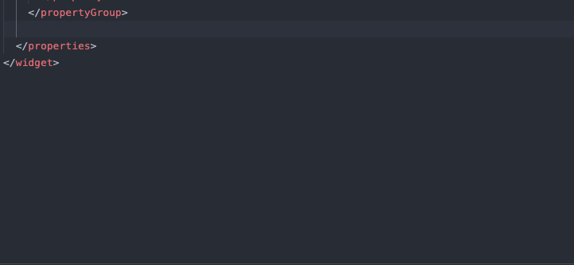
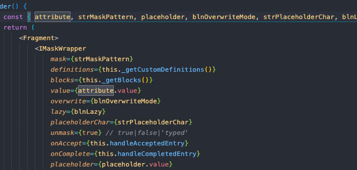
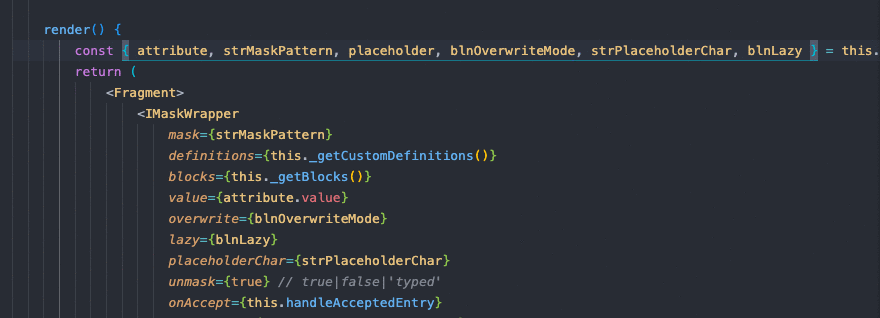

# mendix-pluggable-widget-utilities

⚡️ A VS Code extension to supercharge your pluggable widget development flow.

## Features

✂ Pluggable widget properties snippets with handy default names and placeholders

👀Peek to definitions of widget properties from your JSX

🔐View widget properties type definitions on hover--no need to visit the docs pages.

## Requirements

VS Code ^1.47.0

## Extension Settings

- None

## Known Issues

* None

## Release Notes

Users appreciate release notes as you update your extension.

### 1.0.0

Initial release

## Contribution

Now acepting issues and pull requests: https://github.com/cdcharlebois/vscode-mx-pluggable-widget-utilities/issues

